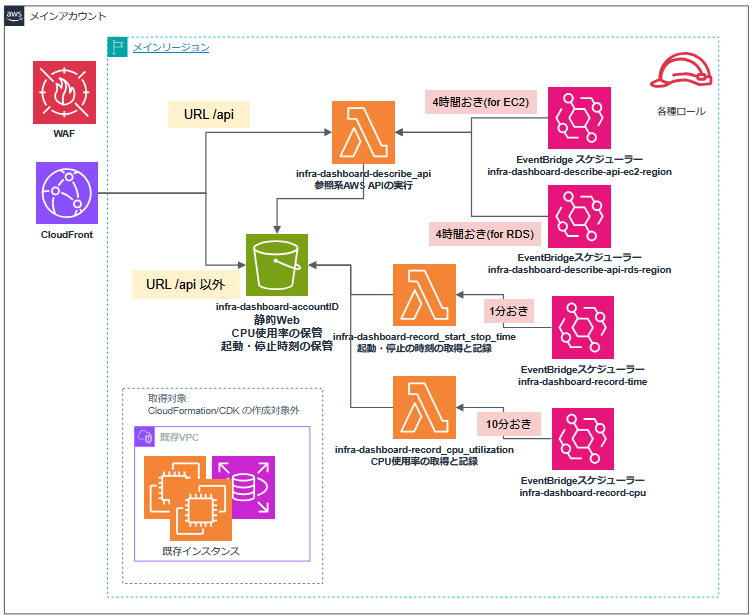

# aws-infra-dashboard

AWSアカウント内のEC2/RDSの稼働状況を、CloudFront経由のWeb画面で確認するためのダッシュボードです。

EC2/RDSの現在の状態、日ごとの起動・停止履歴をひとつの画面に表示します。AWSコンソールを何画面も移動せずに、「どのインスタンスが、いつ、どの時間帯に、稼働していたか」を確認する用途に向いています。


## 日本前提の設計について

本ツールは日本での利用を前提としています。具体的には以下が該当します。

- 画面の表示言語は日本語のみ（i18n非対応）
- CloudFrontの地理的制限がデフォルトで日本のみ許可
- タイムゾーンのデフォルトが `Asia/Tokyo`

日本以外で利用する場合は、[instructions.md](instructions.md) の該当オプションおよび `lib/global-stack.ts` の `geoRestriction` を変更してください。

## 基本機能

- 縦軸が各インスタンス、横軸が24時間のマトリクス表示
- EC2とRDSの稼働状況を同時に表示
- 日付を切り替えて過去日の稼働状況を確認
- 稼働中、停止済み、システム異常、終了済み(Terminated)の状態を色分け表示
- タグで分類、絞り込み、列の選択表示
- データを蓄積することで何カ月も前からの変遷を表示
- CPU使用率を重ねて表示
- CloudFront + S3 + Lambda によるサーバーレス構成
- Excelファイル形式(xlsx)でエクスポート

## さらなる機能

- マルチアカウントに対応。複数アカウントを同一テーブルで表示（後述）
- マルチリージョンに対応。一時点では単一リージョンの表示で、切り替えて表示
- 表示したい列をON/OFFで切り替え
- CPU使用率を重ねて表示したくない場合にOFFへ変更
- Nameタグの右のアイコンを押してインスタンスごとの履歴画面へ遷移
- 多彩な絞り込み表示
  - ドロップダウンの選択肢での絞り込み
  - URLパラメーター(クエリ文字列)で表示対象インスタンスの絞り込み
  - Nameタグの値を正規表現により表示対象インスタンスの絞り込み
- アクセス元IPアドレスの範囲指定による接続制限

## AWS構成

CDKでデプロイすると以下のリソースが作成されます。

- S3バケット ×1
  - バケット内に静的WebファイルとLambda関数による出力ファイルを配置
- Lambda関数 ×3（以下の関数名はソースファイル名／役割名です。デプロイ後のAWS上の物理名は `<tool-name-prefix>` を付与した名前になります）
  - **describe_api**（AWS上の名前: `<tool-name-prefix>-describe-instance-api`）: 参照系のAWS APIを実行してjson形式で取得orS3保存する関数
  - **record_start_stop_time**（AWS上の名前: `<tool-name-prefix>-record-time`）: インスタンスの起動・停止時刻を記録する関数
  - **record_cpu_utilization**（AWS上の名前: `<tool-name-prefix>-record-cpu`）: CPU使用率を取得してS3バケットに蓄積する関数
- EventBridge Scheduler　×4～
  - 1分に1回 `record_start_stop_time` 関数のスケジュール
  - 10分に1回 `record_cpu_utilization` 関数のスケジュール
  - 4時間に1回 `describe_api` 関数(EC2記録用オプション)のスケジュール
  - 4時間に1回 `describe_api` 関数(RDS記録用)のスケジュール
- CloudFront x1
  - S3バケットおよび describe_api Lambda関数のフロントとなる
- WAF x1
- IP許可リスト (オプション)
- 関連するIAMロール/ポリシー

WebファイルはS3に配置され、ブラウザからはCloudFront経由でアクセスします。API呼び出しは `/api*` でCloudFrontからLambda Function URLへ転送されます。S3バケットとLambda Function URLは直接公開せず、CloudFront経由で利用する構成です。  
EventBridge Schedulerは、稼働履歴、CPU使用率、EC2/RDS describe結果の収集を定期実行します。収集したデータはS3に保存され、Web画面がそれを読み込んで表示します。

### 構成図



## セットアップ

詳細な手順は [instructions.md](instructions.md) を参照してください。

基本的な流れは以下です。

1. リポジトリをクローン
2. `npm ci` を実行
3. AWS にログイン
4. CDK bootstrap を実行
5. デプロイスクリプトを実行

メインのリージョンが東京リージョン(ap-northeast-1)の場合の最小例です。

```
git clone https://github.com/hayayu0/aws-infra-dashboard aws-infra-dashboard
cd aws-infra-dashboard
npm ci
aws login
aws sts get-caller-identity
npx cdk bootstrap aws://<accountId>/ap-northeast-1
npx cdk bootstrap aws://<accountId>/us-east-1
(bashの場合) chmod +x ./tools/deploy-cdk.sh
(bashの場合) ./tools/deploy-cdk.sh
(PowerShellの場合) .\tools\deploy-cdk.ps1
```

bash / CloudShell / PowerShell それぞれの具体的なコマンド例、bootstrap 対象リージョン、IP制限、タグ分類、複数リージョン指定などは [instructions.md](instructions.md) にまとめています。

## デプロイ例

最小構成、フルオプション、bash / CloudShell / PowerShell の各コマンド例は [instructions.md](instructions.md) を参照してください。

## 設定ファイル

Web画面の初期表示やタグ分類は `src/web/script/config.js` で管理します。デプロイスクリプトは、指定されたオプションをもとにデプロイ時の `config.js` を生成してS3へ配置します。  
[instructions.md](instructions.md) を参照してください。

## 開発用ファイル

CDKはTypeScriptで記述されています。

- `bin/infra-dashboard.ts`: CDKアプリのエントリポイント
- `lib/local-stack.ts`: メインのリージョン側リソース
- `lib/global-stack.ts`: CloudFront/WAF側リソース
- `src/web`: Web画面
- `src/lambda-python`: Lambda関数コード
- `tools/deploy-cdk.ps1`: Windows/PowerShell用デプロイ
- `tools/deploy-cdk.sh`: bash用デプロイ

`package.json`、`package-lock.json`、`tsconfig.json` は、CDKの依存関係とTypeScript検査を再現するためにリポジトリ直下に置いています。

## ライセンス

MIT License です。

## 注意事項

- デプロイするとAWSリソースが作成され、利用状況に応じて微量ながら課金されます。
- CloudFrontはグローバルサービスのため、関連スタックは `us-east-1` に作成されます。
- AWS WAFのIPSetの仕様で、全IPの許可を意味する `/0` のCIDRは使えません。フィルター作成オプションをtrueにしてかつ、全IPを許可したい場合は `0.0.0.0/1,128.0.0.0/1` (IPv4) `::/1,8000::/1` (IPv6) といったテクニックで回避できます。ただし、CloudFrontでは日本からの地理的アクセスのみ許可を入れているので、必要に応じて解除が必要になることに注意ください。
- EC2はNameタグが必須です。Nameタグが無いEC2は収集・表示の対象になりません（詳細は [manual.md](manual.md) の制約を参照）。
