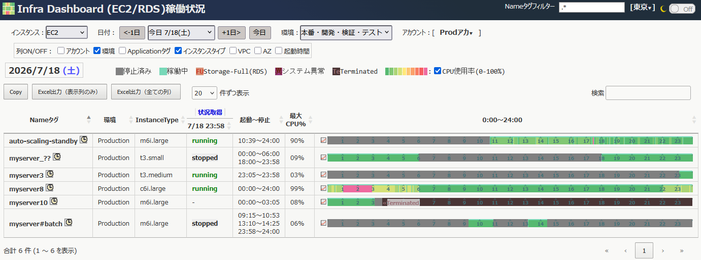

# aws-infra-dashboard

AWSアカウント内のEC2/RDSの稼働状況を、CloudFront経由のWeb画面で確認するためのダッシュボードです。

EC2/RDSの現在の状態、日ごとの起動・停止履歴をひとつの画面に表示します。AWSコンソールを何画面も移動せずに、「どのインスタンスが、いつ、どの時間帯に、稼働していたか」を確認する用途に向いています。



## 基本機能

- 縦軸が各インスタンス、横軸が24時間のマトリクス表示
- EC2とRDSの稼働状況を同時に表示
- 日付を切り替えて過去日の稼働状況を確認
- 稼働中、停止済み、System異常、終了済み(Terminated)の状態を色分け表示
- タグで分類、絞り込み、列の選択表示
- データを蓄積することで何カ月も前からの変遷を表示
- CPU使用率を重ねて表示
- CloudFront + S3 + Lambda によるサーバーレス構成
- Excelファイル形式(xlsx)でエクスポート

## さらなる機能

- マルチアカウントに対応。複数アカウントを同一テーブルで表示（後述）
- マルチリージョンに対応。一時点では単一リージョンの表示で、切り替えて表示
- 表示したい列をON/OFFで切り替え
- CPU使用率を重ねて表示したくない場合にOFFへ変更
- Nameタグの右のアイコンを押してインスタンスごとの履歴画面へ遷移
- 多彩な絞り込み表示
  - ドロップダウンの選択肢での絞り込み
  - URLパラメーター(クエリ文字列)で表示対象インスタンスの絞り込み
  - Nameタグの値を正規表現により表示対象インスタンスの絞り込み
- アクセス元IPアドレスの範囲指定による接続制限

## AWS構成

CDKでデプロイすると以下のリソースが作成されます。

- S3バケット ×1 ()
  - バケット内に静的Webファイル配置
- Lambda関数 ×3
- EventBridge Scheduler　×5
- CloudFront
- CloudFront Origin Access Control
- WAF/IP許可リスト
- 関連するIAMロール/ポリシー

WebファイルはS3に配置され、ブラウザからはCloudFront経由でアクセスします。API呼び出しは `/api*` でCloudFrontからLambda Function URLへ転送されます。S3バケットとLambda Function URLは直接公開せず、CloudFront経由で利用する構成です。

EventBridge Schedulerは、稼働履歴、CPU使用率、EC2/RDS describe結果の収集を定期実行します。収集したデータはS3に保存され、Web画面がそれを読み込んで表示します。

## セットアップ

詳細な手順は [instructions.md](instructions.md) を参照してください。

最小の流れは以下です。

```powershell
git clone https://github.com/hayayu0/aws-infra-dashboard aws-infra-dashboard
cd aws-infra-dashboard
npm ci
aws login
.\tools\deploy-cdk.ps1
```

PowerShell版のフルオプション例、bash版の例、IP制限、タグ分類、複数リージョン指定などは [instructions.md](instructions.md) にまとめています。

## デプロイ例

単一アカウント、東京リージョン中心でデプロイする最小例です。

```powershell
.\tools\deploy-cdk.ps1
```

複数リージョン、タグ分類、IP許可リストを指定する例です。

```powershell
.\tools\deploy-cdk.ps1 `
  -ToolNamePrefix infra-dashboard `
  -RegionalRegion ap-northeast-1 `
  -OtherRegions "ap-northeast-3,ap-southeast-1" `
  -TagCategory Application `
  -TagCategoryLabel "環境" `
  -TagCategorySelections "DB,Web,AP,*" `
  -TagCategory2 Env `
  -EnableIpAllowList true `
  -AllowedIpV4Cidr "0.0.0.0/1,128.0.0.0/1" `
  -AllowedIpV6Cidr "::/1,8000::/1"
```

`ToolNamePrefix` はAWSリソース名に使われるため、作成後に変更しない前提で決めてください。

## 設定ファイル

Web画面の初期表示やタグ分類は `src/web/style/config.js` で管理します。デプロイスクリプトは、指定されたオプションをもとにデプロイ時の `config.js` を生成してS3へ配置します。

主な設定項目です。

- `accounts`
- `groupTagFilter`
- `categoryTag`
- `defaultRegionId`
- `timezoneOffset`
- `demo`

デモ表示では、`demo.now` と `demo.message` を設定することで、特定日を「今日」として表示できます。

## 開発用ファイル

CDKはTypeScriptで記述されています。

- `bin/infra-dashboard.ts`: CDKアプリのエントリポイント
- `lib/local-stack.ts`: リージョン側リソース
- `lib/global-stack.ts`: CloudFront/WAF側リソース
- `src/web`: Web画面
- `src/lambda-python`: Lambda関数コード
- `tools/deploy-cdk.ps1`: Windows/PowerShell用デプロイ
- `tools/deploy-cdk.sh`: bash用デプロイ

`package.json`、`package-lock.json`、`tsconfig.json` は、CDKの依存関係とTypeScript検査を再現するためにリポジトリ直下に置いています。

## ライセンス

MIT License です。

## 注意事項

- デプロイするとAWSリソースが作成され、利用状況に応じて微量ながら課金されます。
- CloudFrontはグローバルサービスのため、関連スタックは `us-east-1` に作成されます。
- AWS WAFのIPSetの制約上、全てのIPの許可を意味する `/0` のCIDRは使えません。フィルター作成オプションをtrueにしてかつ、全IPを許可したい場合は `0.0.0.0/1,128.0.0.0/1` (IPv4) `::/1,8000::/1` (IPv6) というテクニックで回避できます。
- 

